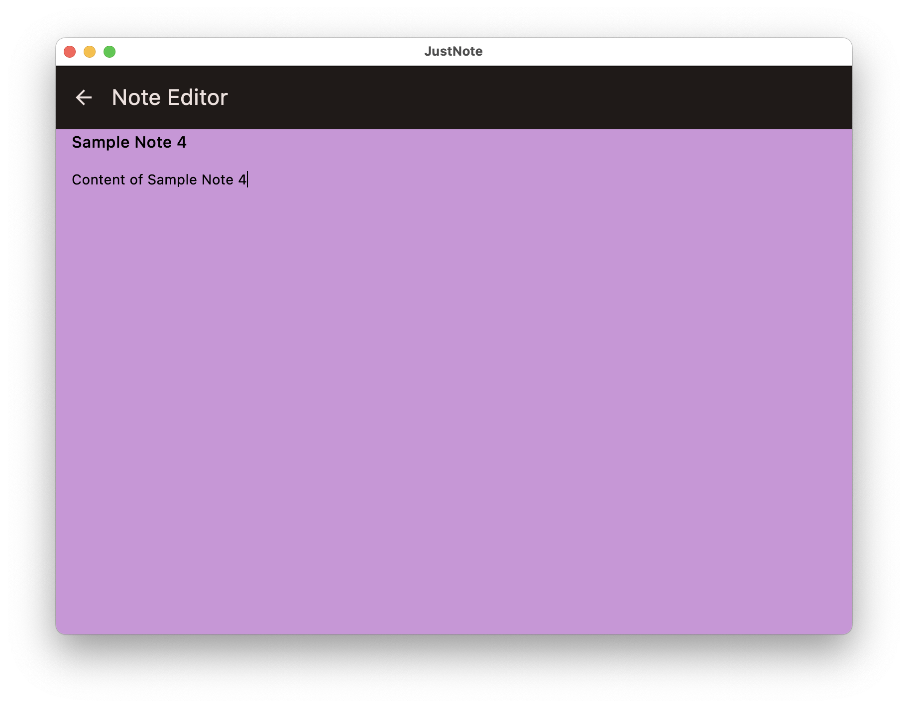

# JustNote

A minial note taking application built with Kotlin Multiplaform + Compose Multiplatform with clean architecture.

**Targets**

- Android
- iOS
- Desktop (JVM) for MacOs, Windows & Linux

Techstack

- Koin for dependency injection
- SQLdelight for databse
- Compose Multiplatform for shared UI
- Voyager for Navigation & UI State Managment
- Compose Material 3

## Screenshots

### Android

| Notes List  | Note Editor  |
|---|---|
|   |   |

### iOS

| Notes List  | Note Editor  |
|---|---|
|   |   |

### MacOS

| Notes List  | Note Editor  |
|---|---|
|   |   |

